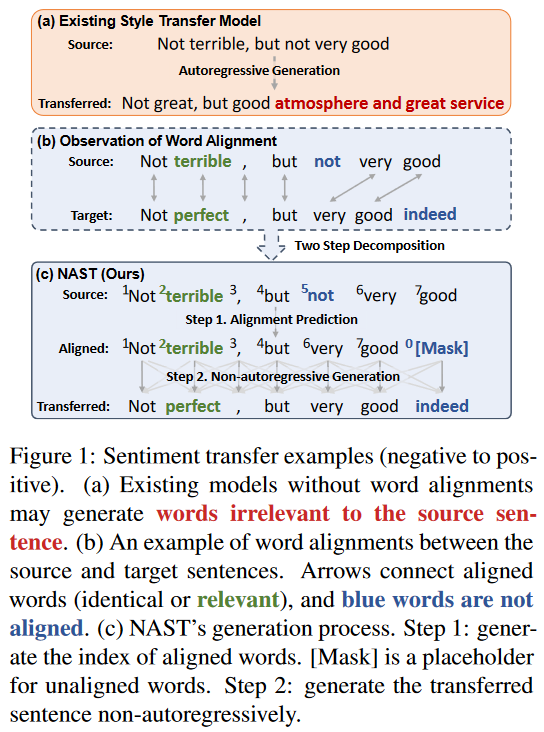

# NAST

This repository contains the codes and model outputs for the paper [*NAST: A Non-Autoregressive Generator with Word Alignment for Unsupervised Text Style Transfer*](https://aclanthology.org/2021.findings-acl.138.pdf) (Findings of ACL 2021)



## Outputs

We release the outputs of NAST under [`outputs`](./outputs).

```
YELP: outputs/YELP/{stytrans|latentseq}_{simple|learnable}/{pos2neg|neg2pos}.txt
GYAFC: outputs/GYAFC/{stytrans|latentseq}_{simple|learnable}/{fm2inf|inf2fm}.txt
```

* ``{stytrans|latentseq}`` indicates the base model, i.e., [StyTrans](https://arxiv.org/abs/1905.05621) or [LatentSeq](https://arxiv.org/abs/2002.03912).
* ``{simple|learnable}`` indicates the two alignment strategies.


## Requirements

* python >= 3.7
* pytorch >= 1.7.1
* cotk == 0.1.0 (pip install cotk == 0.1.0)
* transformers == 3.0.2
* tensorboardX

## Evaluation

The evaluation code is under  [``eval``](./eval).

We use 6 metrics in paper:

* ``PPL``: The perplexity of transferred sentences, which is evaluated by a finetuned GPT-2 base.
* ``Acc``: The accuracy of the transferred sentences' style, which is evaluated by a finetuned Roberta-base.
* ``SelfBleu``: The bleu score between the source sentences and the transferred sentences.
* ``RefBleu``: The bleu score between the transferred sentences and the human references.
* ``G2``: Geometric mean of Acc and RefBLEU, ``sqrt(Acc * RefBLEU)``.
* ``H2``: Harmonic mean of Acc and RefBLEU``Acc * RefBLEU / (Acc + RefBLEU)``.

The codes also provides other 3 metrics:

* ``self_G2``: Geometric mean of Acc and SelfBLEU, ``sqrt(Acc * SelfBleu)``.
* ``self_H2``: Harmonic mean of Acc and SelfBLEU``Acc * SelfBLEU / (Acc + SelfBLEU)``.
* ``Overall``: Use G2 if available, otherwise ``self_G2``.

### Data Preparation

The ``YELP`` data can be downloaded [here](https://cloud.tsinghua.edu.cn/f/caf765b062ed49838111/?dl=1) and should be put under ``data/yelp``.

We cannot provide the GYAFC data because copyright issues. You can download the [data](https://github.com/raosudha89/GYAFC-corpus) and the [human references](https://github.com/luofuli/DualRL/tree/master/references/GYAFC), and then preprocess the data following the format as  the YELP data. We use family&relationship domain in all our experiments. The GYAFC data should be put under ``data/GYAFC_family``.

### Pretrained Classifier & Language Model

The evaluation codes require a pretrained classifier and a language model. We provide our pretrained models below.

|       | Classifier | Language Model |
| ----- | ---------- | -------------- |
| YELP  | [Link](https://cloud.tsinghua.edu.cn/f/76d0ca2891684f36b7ea/?dl=1)   | [Link](https://cloud.tsinghua.edu.cn/f/f97d674753b9487b85ab/?dl=1)       |
| GYAFC | [Link](https://cloud.tsinghua.edu.cn/f/34ba745209c6461a87a6/?dl=1)   | [Link](https://cloud.tsinghua.edu.cn/f/6febf2253b8d4d719de3/?dl=1)       |

Download the models and put them under the ``./eval/model/``.

See the [training instructions](#train-your-classifier--language-model) for how to train the classifier and language model. You should keep the same classifier and language model to evaluate NAST and baselines, otherwise the results cannot be compared.

### Usage

For YELP:

```bash
cd eval
python eval_yelp.py --test0 test0.out --test1 test1.out
```

``test0.out`` and ``test1.out`` should be the generated outputs.

Other arguments (Optional):

```
--allow_unk (Allow unknown tokens in generated outputs)
--dev0 dev0.out  (Evaluate the result on the dev set)
--dev1 dev1.out  (Evaluate the result on the dev set)
--datadir DATADIR (The data path, default: ../yelp_transfer_data)
--clsrestore MODELNAME (The file name of the pretrained classifier, default: cls_yelp_best. The corresponding path is ./model/MODELNAME.model)
--lmrestore MODELNAME (The file name of the pretrained language model, default: lm_yelp_best. Indicating ./model/MODELNAME.model)
--cache  (Build cache to make the evaluation faster)
```

For GYAFC:

```bash
python eval_GYAFC.py --test0 test0.out --test1 test1.out
```

The other arguments are similar with YELP.

### Example Outputs

```
domain  acc     self_bleu       ref_bleu        ppl   self_g2    self_h2    g2     h2     overall
test0   0.862   0.629   0.491   156.298 0.737   0.727   0.650   0.625   0.650
test1   0.910   0.638   0.633   88.461  0.762   0.750   0.759   0.747   0.759
```

You can find results of NAST [here](./outputs/Readme.md).

### Train your Classifier / Language Model

Training scripts:

```bash
cd eval
% train a classifier
python run_cls.py --name CLSNAME --dataid ../data/yelp --pos_weight 1 --cuda
% train a language model
python run_lm.py --name LMNAME --dataid ../data/yelp --cuda
```

Arguments:

* ``name`` can be an arbitrary string, which is used for identifying checkpoints and tensorboard curves.
* ``dataid`` specifies the data path. 
* ``pos_weight`` specifies the sample weight for label 1 (positive sentences in YELP dataset). A number bigger than 1 make the model bias to the label 1.  (In GYAFC, we use ``pos_weight=2``.)
* ``cuda`` specifies the model use GPU in training.

See ``run_cls.py`` or ``run_lm.py`` for more arguments.

You can track the training process by Tensorboard, where the log will be under ``./eval/tensorboard``.

The trained model will be saved in ``./eval/model``.

## Training: Style Transformer

### Data Preparation

Follow the same instructions as [here](#data-preparation).

### Use the Pretrained Classifier

The classifier is used for validation.

You can download a [pretrained classifier](#pretrained-classifier--language-model) or [train a classifier yourself](#train-your-classifier--language-model). Then **put them under ``./styletransformer/model``**.

### Train NAST

**Simple Alignment**:

```
cd styletransformer
python run.py --name MODELNAME --dataid ../data/yelp --clsrestore cls_yelp_best
```

**Learnable Alignment**:

```
cd styletransformer
python run.py --name MODELNAME --dataid ../data/yelp --clsrestore cls_yelp_best --use_learnable --pretrain_batch 1000
```

Arguments:

- ``name`` can be an arbitrary string, which is used for identifying checkpoints and tensorboard curves.
- ``dataid`` specifies the data path. 
- ``clsrestore`` specifies the name of pretrained model.
- ``use_learnable`` uses learnable alignment.
- ``pretrain_batch`` specifies steps for pretraining (only use cycle loss).

See ``run.py`` for more arguments.

You can track the training process by Tensorboard, where the log will be under ``./styletransformer/tensorboard``.

The trained model will be saved in ``./styletransformer/model``.


## Todo

* Add the implementation for LatentSeq

## Acknowledgement & Related Repository

Thanks [DualRL](https://github.com/luofuli/DualRL) for providing multiple human references and some baselines' outputs.
Thanks [StyIns](https://github.com/XiaoyuanYi/StyIns) for other baselines' outputs.
Thanks [StyTrans](https://github.com/fastnlp/style-transformer) and [LatentSeq](https://github.com/cindyxinyiwang/deep-latent-sequence-model) for providing great base models.

## Citing

Please kindly cite our paper if this paper and the codes are helpful.

```
@inproceedings{huang2021NAST,
  author = {Fei Huang and Zikai Chen and Chen Henry Wu and Qihan Guo and Xiaoyan Zhu and Minlie Huang},
  title = {{NAST}: A Non-Autoregressive Generator with Word Alignment for Unsupervised Text Style Transfer},
  booktitle = {Proceedings of the 59th Annual Meeting of the Association for Computational Linguistics: Findings},
  year = {2021}
}
```
